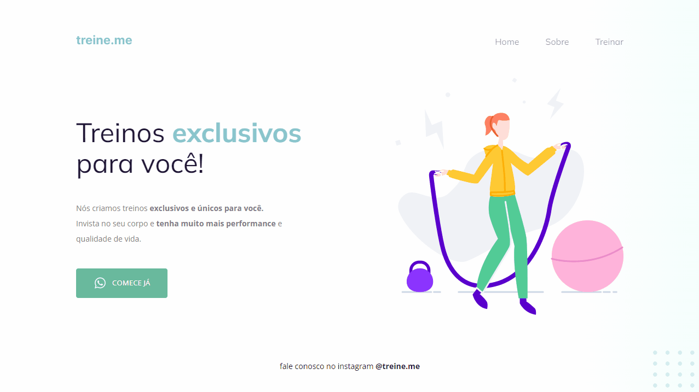

    <h1>Desafio 3 - Semântica e acessibilidade</h1>

 

# Sobre o desafio

 Desafio 3 concluido - Foi recebido um código com defeitos e sem o uso da semântica correta 

 

# Resolução do problema

* Código foi refatorado eliminando os problemas apresentados no código 

# Features 
- [x]  Layout do Desafio 3 da segunda semana do Programa Explorer

 

# DEMO 

<h1 align="center">
    
</h1>